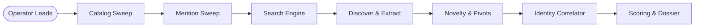

<div align="center">

```text
 ███████╗██████╗ ███████╗ ██████╗████████╗██████╗ ███████╗
 ██╔════╝██╔══██╗██╔════╝██╔════╝╚══██╔══╝██╔══██╗██╔════╝
 ███████╗██████╔╝█████╗  ██║        ██║   ██████╔╝█████╗
 ╚════██║██╔═══╝ ██╔══╝  ██║        ██║   ██╔══██╗██╔══╝
 ███████║██║     ███████╗╚██████╗   ██║   ██║  ██║███████╗
 ╚══════╝╚═╝     ╚══════╝ ╚═════╝   ╚═╝   ╚═╝  ╚═╝╚══════╝
          E V I D E N C E - F I R S T   O S I N T
```

# PUBLIC INTELLIGENCE WORKSTATION

**Public traces. Provenance on every field. Identity never assumed.**

[](#)
[](README.pt-BR.md)
&nbsp;|&nbsp;
[](pyproject.toml)
[](LICENSE)
[](CHANGELOG.md)
[](docs/evidence-model.md)
[](docs/getting-started.md)
[](https://github.com/slycoder0/spectre-osint/actions/workflows/ci.yml)

<p align="center">
  A local, passive-first intelligence workstation for correlating public profiles, indexed mentions, and externally observed digital footprints without laundering guesses into facts.
</p>

</div>

---

## [01] Intelligence Index

<table>
  <tr>
    <td width="33%" valign="top">
      <h4>[ 01 ] BOOTSTRAP</h4>
      <ul>
        <li><a href="docs/getting-started.md">Quick Start Guide</a></li>
        <li><a href="docs/getting-started.md#environment-configuration">Configuration & .env</a></li>
        <li><a href="docs/getting-started.md#diagnostic-check-spectre-doctor">Diagnostic Doctor</a></li>
        <li><a href="docs/troubleshooting.md">Troubleshooting Guide</a></li>
      </ul>
    </td>
    <td width="33%" valign="top">
      <h4>[ 02 ] INTELLIGENCE MODEL</h4>
      <ul>
        <li><a href="docs/evidence-model.md">Evidence & Invariants</a></li>
        <li><a href="docs/evidence-model.md#conservative-identity-correlation">Identity Correlation</a></li>
        <li><a href="docs/search-discovery.md">Search & Discovery</a></li>
        <li><a href="docs/authenticated-public.md">Authenticated Public</a></li>
      </ul>
    </td>
    <td width="33%" valign="top">
      <h4>[ 03 ] OPERATOR REFERENCE</h4>
      <ul>
        <li><a href="docs/cli-reference.md">CLI Command Reference</a></li>
        <li><a href="docs/ARCHITECTURE.md">Architecture Map</a></li>
        <li><a href="docs/TESTING.md">Testing Guidelines</a></li>
        <li><a href="SECURITY.md">Security & Disclosures</a></li>
      </ul>
    </td>
  </tr>
</table>

---

## [02] Evidential Invariants

SPECTRE rejects the practice of turning automated guesses into confirmed identities.

```text
┌─────────────────────────────────────────────────────────────────────────────┐
│                         CORE EVIDENTIAL INVARIANTS                          │
├─────────────────────────────────────────────────────────────────────────────┤
│  ✖  HTTP 200 ≠ Confirmed Identity      ✖  Same Username ≠ Same Person       │
│  ✖  Operator Input ≠ Observed Fact     ✖  Search Candidate ≠ CONFIRMED      │
│  ✔  Strict Field-Level Provenance      ✔  Conservative Identity Clustering │
└─────────────────────────────────────────────────────────────────────────────┘
```

- **HTTP 200 is never enough:** Proof requires platform-specific structural markers (`CONFIRMED` / `LIKELY`).
- **Provenance preserved:** Operator inputs are kept strictly distinct from observed web artifacts.
- **Generic titles rejected:** Platform branding (e.g. *"TryHackMe | Cyber Security Training"*) is stripped from observed display names.
- **Fail-fast resilience:** Deterministic TLS verification errors and host outages fail immediately without wasting retry cycles.

[Read the complete Evidence Model →](docs/evidence-model.md)

---

## [03] Investigation Pipeline

Username investigations execute across strict deterministic stages:



1. **Catalog Sweep:** Queries sites catalog (`sites.yaml`) with factual counts.
2. **Mentions & Search:** Probes public search indexes, extract candidate profiles and indicators.
3. **Novelty Classification:** Tags indicators as `NOVEL`, `DERIVED`, `KNOWN`, `OPERATOR_INPUT`, or `REDUNDANT`.
4. **Identity Correlation:** Evaluates frozen pairwise weights (avatar hashes, bio handles, social links).
5. **Dossier & Reporting:** Generates interactive graph, HTML, JSON, Markdown, CSV, and GraphML reports.

[Explore Search Intelligence & Novelty →](docs/search-discovery.md)

---

## [04] Key Capabilities

| Capability | What SPECTRE Delivers | Reference |
| :--- | :--- | :--- |
| **Username Intelligence** | Public profile detection across platforms with deterministic classifiers. | [Evidence Model](docs/evidence-model.md) |
| **Search Intelligence** | Query planning, candidate discovery, indicator extraction, and novelty tracking. | [Search & Discovery](docs/search-discovery.md) |
| **Authenticated Public** | Isolated SPECTRE-owned Chromium profiles for login-walled public pages. | [Authenticated Public](docs/authenticated-public.md) |
| **Identity Correlation** | Pairwise public-profile correlation using conservative frozen weights. | [Evidence Model](docs/evidence-model.md#conservative-identity-correlation) |
| **Local Workstation** | Localhost FastAPI + Jinja2 GUI with interactive graphs and live dossiers. | [Getting Started](docs/getting-started.md#launching-the-workstation-gui) |
| **Diagnostic Doctor** | Environment health verification without exposing keys or credentials. | [CLI Reference](docs/cli-reference.md#4-spectre-doctor) |

---

## [05] Investigation Outputs

SPECTRE compiles verified findings into structured local artifacts:

```text
┌─ INVESTIGATION ARTIFACTS & OUTPUTS ────────────────────────────────────────┐
│  • Interactive Dossier (Web GUI)      • Standalone HTML Report             │
│  • Interactive Identity Graph (D3)    • Machine-Readable JSON & Markdown   │
│  • Evidence Provenance Drawers        • Tabular CSV & GraphML Exports      │
└────────────────────────────────────────────────────────────────────────────┘
```

---

## [06] Quick Start

```bash
# 1. Clone repository
git clone https://github.com/slycoder0/spectre-osint.git
cd spectre-osint

# 2. Setup virtual environment
python3 -m venv .venv
source .venv/bin/activate  # On Windows: .\.venv\Scripts\Activate.ps1

# 3. Install dependencies & verify environment
pip install -e .
spectre doctor

# 4. Launch localhost dashboard (http://127.0.0.1:8000)
spectre dashboard
```

[Read full Installation & Configuration Guide →](docs/getting-started.md)

---

## [07] Command Line Usage

```bash
# Basic username investigation
spectre username alice_osint

# Comprehensive case with operator leads
spectre username alice_osint \
  --alias alice-sec \
  --name "Alice Example" \
  --email alice@example.com \
  --website alice.example

# Interactive manual login for authenticated-public mode
spectre auth login instagram
spectre auth status
```

[Consult full CLI Reference Manual →](docs/cli-reference.md)

---

## [08] Operational Boundaries

- **Passive-First:** Default mode collects only publicly indexed data. Active TCP network scanning is disabled unless `--authorized` is explicitly provided.
- **Localhost Bound:** The workstation dashboard binds strictly to `127.0.0.1`.
- **No Exploitation or Evasion:** SPECTRE does not solve CAPTCHAs, spoof TLS fingerprints, rotate residential proxies, or bypass access controls.
- **No Credential Access:** Passwords are typed manually by the operator in a visible browser window; SPECTRE never collects, stores, or transmits passwords.

---

## [09] Project Status

- **Version:** `0.1.0b1` (Beta validated — release candidate ready)
- **License:** [MIT](LICENSE)
- **Security:** Report vulnerabilities via GitHub Security Advisories ([SECURITY.md](SECURITY.md))
- **Contributing:** Guidelines and synthetic testing requirements in [CONTRIBUTING.md](CONTRIBUTING.md)

---

<div align="center">
  <sub>SPECTRE OSINT · Built for evidence-first digital investigations.</sub>
</div>
