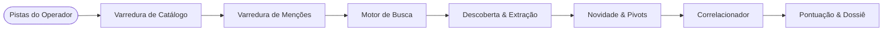

<div align="center">

```text
 ███████╗██████╗ ███████╗ ██████╗████████╗██████╗ ███████╗
 ██╔════╝██╔══██╗██╔════╝██╔════╝╚══██╔══╝██╔══██╗██╔════╝
 ███████╗██████╔╝█████╗  ██║        ██║   ██████╔╝█████╗
 ╚════██║██╔═══╝ ██╔══╝  ██║        ██║   ██╔══██╗██╔══╝
 ███████║██║     ███████╗╚██████╗   ██║   ██║  ██║███████╗
 ╚══════╝╚═╝     ╚══════╝ ╚═════╝   ╚═╝   ╚═╝  ╚═╝╚══════╝
          E V I D E N C E - F I R S T   O S I N T
```

# WORKSTATION DE INTELIGÊNCIA PÚBLICA

**Rastros públicos. Proveniência em cada campo. Identidade nunca presumida.**

[](README.md)
[](#)
&nbsp;|&nbsp;
[](pyproject.toml)
[](LICENSE)
[](CHANGELOG.md)
[](docs/evidence-model.pt-BR.md)
[](docs/getting-started.pt-BR.md)
[](https://github.com/slycoder0/spectre-osint/actions/workflows/ci.yml)

<p align="center">
  Uma workstation de inteligência local e passive-first para correlacionar perfis públicos, menções indexadas e pegadas digitais observadas externamente, sem transformar suposições em fatos.
</p>

</div>

---

## [01] Índice de Inteligência

<table>
  <tr>
    <td width="33%" valign="top">
      <h4>[ 01 ] BOOTSTRAP</h4>
      <ul>
        <li><a href="docs/getting-started.pt-BR.md">Guia de Início Rápido</a></li>
        <li><a href="docs/getting-started.pt-BR.md#configuração-do-ambiente">Configuração & .env</a></li>
        <li><a href="docs/getting-started.pt-BR.md#verificação-de-diagnóstico-spectre-doctor">Diagnóstico Doctor</a></li>
        <li><a href="docs/troubleshooting.pt-BR.md">Resolução de Problemas</a></li>
      </ul>
    </td>
    <td width="33%" valign="top">
      <h4>[ 02 ] MODELO DE INTELIGÊNCIA</h4>
      <ul>
        <li><a href="docs/evidence-model.pt-BR.md">Evidências & Invariantes</a></li>
        <li><a href="docs/evidence-model.pt-BR.md#correlação-conservadora-de-identidades">Correlação de Identidades</a></li>
        <li><a href="docs/search-discovery.pt-BR.md">Busca & Descoberta</a></li>
        <li><a href="docs/authenticated-public.pt-BR.md">Authenticated Public</a></li>
      </ul>
    </td>
    <td width="33%" valign="top">
      <h4>[ 03 ] REFERÊNCIA DO OPERADOR</h4>
      <ul>
        <li><a href="docs/cli-reference.pt-BR.md">Manual da Linha de Comando</a></li>
        <li><a href="docs/ARCHITECTURE.md">Mapa de Arquitetura</a></li>
        <li><a href="docs/TESTING.md">Diretrizes de Teste</a></li>
        <li><a href="SECURITY.md">Segurança & Divulgação</a></li>
      </ul>
    </td>
  </tr>
</table>

---

## [02] Invariantes Probatórios

O SPECTRE rejeita a transformação de suposições automáticas em identidades confirmadas.

```text
┌─────────────────────────────────────────────────────────────────────────────┐
│                      INVARIANTES PROBATÓRIOS FUNDAMENTAIS                   │
├─────────────────────────────────────────────────────────────────────────────┤
│  ✖  HTTP 200 ≠ Identidade Confirmada   ✖  Mesmo Username ≠ Mesma Pessoa     │
│  ✖  Input do Operador ≠ Fato Observado ✖  Candidato de Busca ≠ CONFIRMED    │
│  ✔  Proveniência Estrita por Campo     ✔  Agrupamento Conservador           │
└─────────────────────────────────────────────────────────────────────────────┘
```

- **HTTP 200 nunca é suficiente:** A confirmação exige marcadores estruturais específicos da plataforma (`CONFIRMED` / `LIKELY`).
- **Proveniência preservada:** As entradas do operador são mantidas estritamente separadas das evidências observadas na web.
- **Títulos genéricos rejeitados:** Textos institucionais de plataformas (ex.: *"TryHackMe | Cyber Security Training"*) são removidos dos nomes observados.
- **Resiliência Fail-Fast:** Erros determinísticos de TLS e indisponibilidade de hosts falham imediatamente sem desperdiçar retentativas.

[Leia o Modelo de Evidências Completo →](docs/evidence-model.pt-BR.md)

---

## [03] Pipeline de Investigação

Investigações de username executam através de etapas determinísticas bem definidas:



1. **Varredura de Catálogo:** Consulta o catálogo de plataformas (`sites.yaml`) com contadores factuais em tempo real.
2. **Menções e Busca:** Consulta índices públicos, extrai perfis candidatos e novos indicadores.
3. **Classificação de Novidade:** Categoriza indicadores como `NOVEL`, `DERIVED`, `KNOWN`, `OPERATOR_INPUT` ou `REDUNDANT`.
4. **Correlação de Identidades:** Aplica pesos fixos a pares de evidências (hash de avatar, handles na bio, links sociais).
5. **Dossiê e Relatórios:** Produz grafo interativo, relatórios em HTML, JSON, Markdown, CSV e GraphML.

[Entenda a Inteligência de Busca e Novidade →](docs/search-discovery.pt-BR.md)

---

## [04] Capacidades Principais

| Capacidade | O Que o SPECTRE Oferece | Referência |
| :--- | :--- | :--- |
| **Inteligência de Usernames** | Detecção de perfis em dezenas de plataformas com classificadores determinísticos. | [Modelo de Evidências](docs/evidence-model.pt-BR.md) |
| **Inteligência de Busca** | Planejamento de consultas, descoberta de candidatos, extração de dados e rastreamento de novidade. | [Busca & Descoberta](docs/search-discovery.pt-BR.md) |
| **Authenticated Public** | Perfis Chromium isolados e pertencentes ao SPECTRE para visualização de perfis murados por login. | [Authenticated Public](docs/authenticated-public.pt-BR.md) |
| **Correlação de Identidades** | Avaliação probabilística conservadora entre pares de perfis públicos com pesos congelados. | [Modelo de Evidências](docs/evidence-model.pt-BR.md#correlação-conservadora-de-identidades) |
| **Workstation Local** | Interface web em localhost (FastAPI + Jinja2) com grafos interativos e dossiê em tempo real. | [Primeiros Passos](docs/getting-started.pt-BR.md#iniciando-a-interface-web-workstation-gui) |
| **Diagnóstico Doctor** | Validação da integridade do ambiente e dependências sem expor chaves ou credenciais. | [Referência da CLI](docs/cli-reference.pt-BR.md#4-spectre-doctor) |

---

## [05] Entregáveis da Investigação

O SPECTRE compila achados verificados em artefatos locais estruturados:

```text
┌─ ENTREGÁVEIS & ARTEFATOS DA INVESTIGAÇÃO ──────────────────────────────────┐
│  • Dossiê Interativo (Web GUI)        • Relatório HTML Autossuficiente     │
│  • Grafo de Identidades (D3 / Web)    • JSON Estruturado e Markdown        │
│  • Gavetas de Proveniência de Campo   • Exportações em CSV e GraphML       │
└────────────────────────────────────────────────────────────────────────────┘
```

---

## [06] Início Rápido

```bash
# 1. Clonar o repositório
git clone https://github.com/slycoder0/spectre-osint.git
cd spectre-osint

# 2. Configurar ambiente virtual
python3 -m venv .venv
source .venv/bin/activate  # No Windows: .\.venv\Scripts\Activate.ps1

# 3. Instalar dependências e validar o ambiente
pip install -e .
spectre doctor

# 4. Iniciar a interface web local (http://127.0.0.1:8000)
spectre dashboard
```

[Consulte o Guia de Instalação e Configuração Completo →](docs/getting-started.pt-BR.md)

---

## [07] Uso da Linha de Comando (CLI)

```bash
# Investigação básica de username
spectre username alice_osint

# Caso detalhado com pistas do operador
spectre username alice_osint \
  --alias alice-sec \
  --name "Alice Example" \
  --email alice@example.com \
  --website alice.example

# Login manual interativo para modo authenticated-public
spectre auth login instagram
spectre auth status
```

[Consulte o Manual de Referência Completo da CLI →](docs/cli-reference.pt-BR.md)

---

## [08] Limites Operacionais

- **Passive-First:** O modo padrão coleta exclusivamente informações públicas indexadas. Varredura ativa de rede (portas TCP) é desativada a menos que `--authorized` seja informado explicitamente.
- **Apenas Localhost:** A workstation web escuta estritamente no endereço de loopback `127.0.0.1`.
- **Sem Evasão ou Ataques:** O SPECTRE não resolve CAPTCHAs, não forja TLS, não rotaciona proxies e não burla controles de acesso.
- **Sem Coleta de Senhas:** Senhas são digitadas pelo operador em janela visível de navegador; o SPECTRE nunca solicita, armazena ou transmite senhas.

---

## [09] Estado do Projeto

- **Versão:** `0.1.0b1` (Beta Pública)
- **Licença:** [MIT](LICENSE)
- **Segurança:** Relate vulnerabilidades via GitHub Security Advisories ([SECURITY.md](SECURITY.md))
- **Contribuições:** Diretrizes e regras de testes sintéticos em [CONTRIBUTING.md](CONTRIBUTING.md)

---

<div align="center">
  <sub>SPECTRE OSINT · Desenvolvido para investigações digitais com foco em evidências.</sub>
</div>
