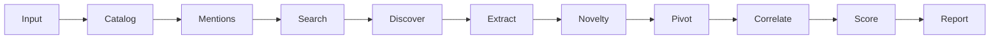

# SPECTRE architecture

Technical map of the current tree. Narrative and invariants live in
[`AI_HANDOFF.md`](AI_HANDOFF.md). This file names **real packages**.

## Username investigation flow



`InvestigationRunner` (`core/pipeline.py`) is the outer loop for every entity type.
Search intelligence is **additional** collection inside `_collect_username_bundle`
(simple and multi-handle username paths). It does not run for domain/IP/hash/etc.
and does not replace the catalog.

## Package map

```
spectre_osint/
  main.py                 CLI entry (`spectre`)
  __init__.py             __version__ = 0.1.0b1
  cli/                    Typer commands, doctor, display
  core/                   config, pipeline, scoring, SSRF, DB, entities, cache
  modules/username/       catalog sweep, evidence, enrichment, identity
  modules/mentions/       public indexed mentions + relevance
  modules/search/         planner, providers, discover, extract, novelty, pivots, summary
  modules/{dns,domain,ip,email,url,hash,company,person,threatintel,certificates,network,metadata}/
  providers/              optional/keyless threat-intel HTTP providers
  browser/                authenticated-public sessions, Chrome/CDP, Playwright
  correlation/            graph + generic pivot suggestions + confidence merge
  reporting/              standalone HTML/JSON/MD/CSV/GraphML artifact generators
  web/                    localhost FastAPI + Jinja2 GUI (DEPRECATED: scheduled for removal in 0.1.0b2)
  data/                   bundled sites.yaml, providers.yaml, user_agents.txt
  migrations/             Alembic 0001_initial
  llm/                    optional, disabled, not in default pipeline
```

## Boundaries (do not collapse)

| Component | Must not |
| --- | --- |
| Search | Decide identity or emit catalog `CONFIRMED` |
| Novelty | Increase confidence/identity scores |
| Mentions | Substitute for username `LIKELY`/`CONFIRMED` |
| Identity | Consume search `discovered_profile` rows |
| UI / reports | Reclassify findings or change scores |
| Pivot | Turn a candidate into a confirmed identity |
| Doctor | Investigate, login, or launch Chrome |
| LLM helper | Mutate collected facts or run by default |

---

## Components

### CLI — `spectre_osint/cli/`

- **Responsibility:** operator commands; `spectre --version`; `spectre doctor`.
- **Inputs:** argv, `.env` / environment via `Settings`.
- **Outputs:** stdout (Rich), exit codes (doctor: 0 ready/optional, 1 action required).
- **Side effects:** investigations write DB + reports; `auth` writes session files;
  `web`/`dashboard` bind loopback. Doctor must not.
- **Deps:** `core`, `browser`, `modules`, `reporting`.

Primary commands: `username`, `email`, `domain`, `ip`, `url`, `hash`, `company`,
`person`, `investigate`, `metadata`, `threat`, `wayback`, `providers`, `report`,
`search` (CSE helper), `web` / `dashboard`, `network`, `case`, `auth`, `cache`,
`doctor`, `version`.

### Pipeline — `core/pipeline.py`

- **Responsibility:** case/run lifecycle, dispatch collectors, score, persist, report.
- **Inputs:** target string, `force_type`, `extra.inputs`, flags (`refresh`, `auto_pivot`).
- **Outputs:** `InvestigationResult`.
- **Side effects:** SQLite rows, report files when `write_report=True`.
- **Deps:** modules, scoring, case manager, reporting, graph export.

### Config / settings — `core/config.py`

- **Responsibility:** env + `.env`; directories; secrets as `SecretStr`.
- **Side effects:** `ensure_dirs()` creates `data/`, `reports/`, `logs/`, `data/cache/`.
- **Note:** `get_settings()` always `ensure_dirs()`. Doctor constructs `Settings()`
  without that when possible so missing dirs become diagnostics.

### Username catalog — `modules/username/`

- **Responsibility:** per-site public presence + typed Site Catalog 2.0 schema validation + HTML evidence + enrichment.
- **Inputs:** username entity, `HttpClient`, concurrency, cache.
- **Outputs:** findings with `check_status`, observed fields + provenance, identity artifacts.
- **Side effects:** result cache under `data/cache/`; optional authenticated fetch via browser.
- **Deps:** `data/sites.yaml`, `modules/username/catalog.py`, `browser` when a session exists, `result_cache`.

### Mentions — `modules/mentions/`

- **Responsibility:** public search-index hits; match + relevance (`DIRECT`/`ASSOCIATED`/`AMBIGUOUS`).
- **Inputs:** handle/name/email/domain leads.
- **Outputs:** `PUBLIC_MENTION` findings (`FindingStatus.OBSERVED`).
- **Side effects:** HTTP to public indexes.
- **Must not:** become catalog LIKELY/CONFIRMED.

### Search intelligence — `modules/search/`

- **Responsibility:** plan queries, search, discover candidates, extract indicators,
  classify novelty, propose budgeted pivots, emit coverage + deterministic summary.
- **Inputs:** `case_inputs`, existing catalog/mention findings, `Settings`.
- **Outputs:** search findings (`kind` in `{discovered_profile, indicator, pivot, coverage, provider_status}`),
  optional derived entities/relationships/pivots.
- **Side effects:** HTTP to public indexes / optional loopback SearXNG.
- **Deps:** mention providers + `SearxngProvider`; novelty uses catalog hosts from
  `identity._PLATFORM_HOSTS` + `sites.yaml`.

### Identity — `modules/username/identity.py`

- **Responsibility:** conservative pairwise clustering of **catalog** CONFIRMED/LIKELY profiles.
- **Inputs:** username findings only.
- **Outputs:** identity finding + `IDENTITY_LINK` relationships for stronger pairs.
- **Frozen:** `WEIGHTS`, `CONFLICTS`, `BANDS`, `CLUSTER_MIN`.

### Scoring — `core/scoring.py`

- **Responsibility:** confidence / risk / reputation for this investigation only.
- **Inputs:** `InvestigationResult`.
- **Outputs:** `ScoreBreakdown`.
- **Must not:** treat mentions or search candidates as confirmed profiles.

### Providers — `providers/` + `core/registry.py`

- **Responsibility:** optional/keyless threat-intel lookups (VT, Shodan, crt.sh, RDAP, …).
- **Outputs:** findings or `NOT_CONFIGURED` / `PROVIDER_UNAVAILABLE`.
- **Must not:** abort the investigation on a single provider failure.

### Browser / auth — `browser/`

- **Responsibility:** operator-driven public sessions (Playwright or Chrome CDP loopback).
- **Inputs:** platform slug; existing profile metadata.
- **Outputs:** `FetchOutcome`, `SessionStatus`.
- **Side effects:** SPECTRE-owned profiles; `storage_state` / keyring.
- **Must not:** store passwords; use personal Chrome user-data; bind CDP off-loopback.

### Persistence — `core/database.py`, `core/models.py`, `core/case_manager.py`

- **Responsibility:** cases, runs, entities, findings, evidence, relationships.
- **Side effects:** SQLite (default) writes under `SPECTRE_DATA_DIR`.

### Web GUI — `web/` (DEPRECATED)

- **Status:** Deprecated in milestone 0.1.0b2; scheduled for staged removal in favor of CLI-first workflow.
- **Responsibility:** single-operator localhost workstation (dossier, graph, sessions, providers).
- **Inputs:** same `CaseManager` / pipeline as CLI.
- **Side effects:** in-memory collection jobs (`web/jobs.py`); file reports.
- **Must not:** change evidence semantics; listen on public interfaces by default.

### Reporting — `reporting/`

- **Responsibility:** standalone artifacts from an `InvestigationResult` (HTML, Markdown, JSON, CSV, GraphML).
- **Side effects:** files under `SPECTRE_REPORTS_DIR` (gitignored).

### Correlation extras — `correlation/`

- **Responsibility:** `build_graph` / GraphML; generic `suggest_pivots`; `merge_confidence`.
- **Must not:** override username identity weights.

---

## Data stores (runtime)

| Store | Default location | Git |
| --- | --- | --- |
| Case SQLite | `./data/spectre.db` | ignored |
| Result/HTTP cache | `./data/cache/` | ignored |
| Reports | `./reports/` | ignored (`reports/.gitkeep` only) |
| Logs | `./logs/` | ignored |
| Auth sessions | `~/.local/share/spectre/auth` | never in repo |
| Chrome profiles | SPECTRE-owned dir | never in repo |
