# Arquitetura do SPECTRE

Mapa técnico completo da estrutura interna do **SPECTRE OSINT**.

---

## 1. Fluxo de Investigação de Username

```mermaid
flowchart LR
    Input([Pistas do Operador]) --> Catalog[Varredura do Catálogo]
    Catalog --> Mentions[Varredura de Menções]
    Mentions --> Search[Motor de Busca]
    Search --> Discover[Descoberta de Perfis]
    Discover --> Extract[Extração de Indicadores]
    Extract --> Novelty[Classificador de Novidade]
    Novelty --> Pivot[Motor de Pivôs]
    Pivot --> Correlate[Correlacionador de Identidades]
    Correlate --> Score[Motor de Pontuação]
    Score --> Report[Gerador de Relatórios]
```



O `InvestigationRunner` (`spectre_osint/core/pipeline.py`) é o loop externo para cada tipo de entidade. A inteligência de busca é uma coleta **adicional** dentro de `_collect_username_bundle` (para caminhos simples e com múltiplos handles). Ela não é executada para domínios, IPs ou hashes e não substitui o catálogo.

---

## 2. Mapa de Pacotes

```text
spectre_osint/
  main.py                 Ponto de entrada da CLI (`spectre`)
  __init__.py             __version__ = 0.1.0b1
  cli/                    Comandos Typer, doctor, display
  core/                   config, pipeline, scoring, SSRF, DB, entities, cache
  modules/username/       Varredura de catálogo, Site Catalog 2.0, enriquecimento, identidade
  modules/mentions/       Menções indexadas públicas e relevância de texto
  modules/search/         Planejador, provedores, discover, extract, novelty, pivots, summary
  modules/{dns,domain,ip,email,url,hash,company,person,threatintel,certificates,network,metadata}/
  providers/              Provedores HTTP de threat intelligence (keyless, optional-key, required-key)
  browser/                Sessões autenticadas públicas, Chrome CDP e Playwright
  correlation/            Grafo de entidades, sugestões de pivôs genéricos e fusão de confiança
  reporting/              Geradores de artefatos standalone em HTML, JSON, Markdown, CSV e GraphML
  web/                    Dashboard local FastAPI + Jinja2 (DEPRECATED: agendado para remoção na 0.1.0b2)
  data/                   sites.yaml (Site Catalog 2.0), providers.yaml, user_agents.txt
  migrations/             Alembic (esquema inicial 0001_initial)
  llm/                    Opcional, desativado, fora do pipeline padrão
```

---

## 3. Fronteiras Arquiteturais Rígidas

| Componente | Regra Rígida (O que NÃO pode fazer) |
| :--- | :--- |
| **Search Engine** | Não pode decidir identidade civil nem emitir status `CONFIRMED` de catálogo. |
| **Novelty Classifier** | Não pode inflar scores de confiança ou identidade automaticamente. |
| **Mentions Module** | Não substitui o status `CONFIRMED` ou `LIKELY` do catálogo oficial. |
| **Identity Correlator** | Não consome linhas não-validadas de descoberta externa (`discovered_profile`). |
| **UI / Relatórios** | Não reclassifica achados nem altera pontuações calculadas pelo core. |
| **Pivot Engine** | Não transforma um candidato de descoberta em identidade confirmada. |
| **Doctor** | Nunca inicia investigações, nunca realiza logins e nunca inicializa o Chrome. |
| **LLM Helper** | Não muta fatos observados e não roda no pipeline padrão por default. |

---

## 4. Detalhamento dos Componentes

### CLI — `spectre_osint/cli/`
- **Responsabilidade:** Comandos do operador, `spectre --version`, `spectre doctor`.
- **Entradas:** `sys.argv`, `.env` e variáveis de ambiente via `Settings`.
- **Saídas:** `stdout` (Rich), códigos de saída (`doctor`: 0 pronto/opcional, 1 ação necessária).
- **Efeitos Colaterais:** Investigações gravam no banco e relatórios; `auth` grava arquivos de sessão; `web`/`dashboard` vinculam a loopback por padrão. O `doctor` não produz efeitos colaterais.
- **Dependências:** `core`, `browser`, `modules`, `reporting`.
- **Comandos Principais:** `username`, `email`, `domain`, `ip`, `url`, `hash`, `company`, `person`, `investigate`, `metadata`, `threat`, `wayback`, `providers`, `report`, `search` (helper CSE), `web`/`dashboard` (legado), `network`, `case`, `auth`, `cache`, `doctor`, `version`.

### Pipeline — `spectre_osint/core/pipeline.py`
- **Responsabilidade:** Ciclo de vida de casos e execuções, despacho de coletores, pontuação, persistência e relatórios.
- **Entradas:** String do alvo, `force_type`, `extra.inputs`, flags (`refresh`, `auto_pivot`).
- **Saídas:** `InvestigationResult`.
- **Efeitos Colaterais:** Linhas no SQLite, arquivos de relatório quando `write_report=True`.
- **Dependências:** Módulos coletores, scoring, case manager, reporting, exportação de grafos.

### Configurações — `spectre_osint/core/config.py`
- **Responsabilidade:** `.env` e variáveis de ambiente; resolução de diretórios; proteção de segredos com `SecretStr`.
- **Efeitos Colaterais:** `ensure_dirs()` cria `data/`, `reports/`, `logs/`, `data/cache/`.
- **Nota:** `get_settings()` sempre executa `ensure_dirs()`. O `doctor` instancia `Settings()` sem criar pastas previamente para diagnosticar diretórios ausentes.

### Catálogo de Usernames — `spectre_osint/modules/username/`
- **Responsabilidade:** Presença pública por site + validação de esquema tipado Site Catalog 2.0 + evidências HTML + enriquecimento.
- **Entradas:** Entidade de username, `HttpClient`, concorrência, cache.
- **Saídas:** Achados (`Finding`) com `check_status`, campos observados com proveniência e artefatos de identidade.
- **Efeitos Colaterais:** Cache de resultados em `data/cache/`; coleta autenticada opcional via navegador.
- **Dependências:** `data/sites.yaml`, `modules/username/catalog.py`, `browser` (quando sessão existe), `result_cache`.

### Menções — `spectre_osint/modules/mentions/`
- **Responsabilidade:** Resultados de índices de busca pública; correspondência e relevância (`DIRECT`, `ASSOCIATED`, `AMBIGUOUS`).
- **Entradas:** Pistas de handle, nome, e-mail e domínio.
- **Saídas:** Achados `PUBLIC_MENTION` com status `FindingStatus.OBSERVED`.
- **Efeitos Colaterais:** Requisições HTTP para motores públicos.
- **Fronteira:** Nunca se torna `CONFIRMED` ou `LIKELY` de catálogo.

### Inteligência de Busca — `spectre_osint/modules/search/`
- **Responsabilidade:** Planejar dorks, buscar, descobrir candidatos, extrair indicadores, classificar novidade, orçar pivôs e emitir sumário determinístico.
- **Entradas:** `case_inputs`, achados existentes de catálogo e menções, `Settings`.
- **Saídas:** Achados de busca (`kind` em `discovered_profile`, `indicator`, `pivot`, `coverage`, `provider_status`).
- **Efeitos Colaterais:** HTTP para motores públicos ou SearXNG local em loopback.
- **Dependências:** Provedores de menções, `SearxngProvider`, hosts de catálogo de `identity._PLATFORM_HOSTS` e `sites.yaml`.

### Identidade — `spectre_osint/modules/username/identity.py`
- **Responsabilidade:** Agrupamento e correlação de pares de perfis `CONFIRMED`/`LIKELY` do catálogo.
- **Entradas:** Achados de username exclusivamente.
- **Saídas:** Achado de identidade e relacionamentos `IDENTITY_LINK` para pares correlacionados.
- **Constantes Congeladas:** `WEIGHTS`, `CONFLICTS`, `BANDS`, `CLUSTER_MIN`.

### Pontuação (Scoring) — `spectre_osint/core/scoring.py`
- **Responsabilidade:** Cálculo de confiança, risco e reputação exclusivos para a execução atual.
- **Entradas:** `InvestigationResult`.
- **Saídas:** `ScoreBreakdown`.
- **Fronteira:** Nunca trata menções ou candidatos de busca como perfis confirmados.

### Provedores de Threat Intelligence — `spectre_osint/providers/` + `spectre_osint/core/registry.py`
- **Responsabilidade:** Consultas estruturadas divididas em:
  - **Keyless (sem chave):** crt.sh, RDAP, Wayback Machine.
  - **Optional Key (chave opcional; eleva quotas):** GitHub, URLScan, IPinfo, GreyNoise, AlienVault OTX.
  - **Required Key (chave necessária):** VirusTotal, Shodan (dados históricos indexados), Censys, AbuseIPDB, HIBP.
- **Saídas:** Achados ou status `NOT_CONFIGURED` / `PROVIDER_UNAVAILABLE`.
- **Fronteira:** A falha de um provedor isolado nunca aborta a investigação.

### Navegador / Autenticação — `spectre_osint/browser/`
- **Responsabilidade:** Sessões públicas do operador (Playwright ou Chrome CDP em loopback).
- **Entradas:** Identificador da plataforma; metadados do perfil.
- **Saídas:** `FetchOutcome`, `SessionStatus`.
- **Efeitos Colaterais:** Perfis dedicados `.spectre-owned`; arquivos de sessão em `storage_state.json` ou chaveiro do SO.
- **Fronteira:** Não armazena senhas, recusa diretórios pessoais do Chrome/Edge (`PathSafetyError`) e vincula CDP estritamente a loopback.

### Persistência — `spectre_osint/core/database.py`, `models.py`, `case_manager.py`
- **Responsabilidade:** Armazenamento de casos, execuções, entidades, achados, evidências e relacionamentos.
- **Efeitos Colaterais:** Gravações no banco SQLite local sob `SPECTRE_DATA_DIR`.

### Interface Web Legada — `spectre_osint/web/` (DEPRECATED)
- **Status:** Depreciada no milestone `0.1.0b2`; agendada para remoção em favor de fluxos CLI-first.
- **Responsabilidade:** Dashboard local para operador único (dossiê, grafo, sessões, provedores).
- **Entradas:** Mesmo `CaseManager` e pipeline da CLI.
- **Efeitos Colaterais:** Jobs assíncronos em memória (`web/jobs.py`), relatórios.
- **Fronteira:** Não altera semântica de evidências; vincula a `127.0.0.1:8000` por padrão (bind público exige opt-in com `SPECTRE_ALLOW_PUBLIC_BIND=true`).

### Relatórios — `spectre_osint/reporting/`
- **Responsabilidade:** Geração de artefatos standalone a partir do `InvestigationResult` (HTML, Markdown, JSON, CSV, GraphML).
- **Efeitos Colaterais:** Gravação de arquivos sob `SPECTRE_REPORTS_DIR` (gitignored).

### Extras de Correlação — `spectre_osint/correlation/`
- **Responsabilidade:** `build_graph` / GraphML, `suggest_pivots` genéricos e fusão de confiança.
- **Fronteira:** Não substitui os pesos congelados de identidade de usernames.

---

## 5. Armazenamento de Dados em Tempo de Execução

| Armazenamento | Localização Padrão | Rastreamento Git |
| :--- | :--- | :--- |
| **Banco de Dados SQLite** | `./data/spectre.db` | Ignorado |
| **Cache de Resultados / HTTP**| `./data/cache/` | Ignorado |
| **Relatórios Gerados** | `./reports/` | Ignorado (apenas `.gitkeep`) |
| **Logs de Execução** | `./logs/` | Ignorado |
| **Sessões Autenticadas** | `~/.local/share/spectre/auth` (Linux/BSD) | Fora do repositório |
| **Perfis do Chromium** | `~/.local/share/spectre/browser-profiles` | Fora do repositório |
