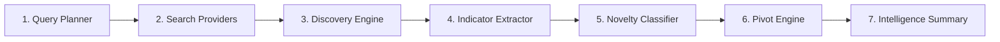

# Busca & Descoberta de Menções

O motor de busca e descoberta (`spectre_osint/modules/search/`) realiza varreduras em motores de busca públicos para identificar menções e novos pivôs.

---

## 1. Pipeline de Busca em 7 Estágios

1. **Planner (`planner.py`):** Gera consultas determinísticas direcionadas com base nas pistas do operador e handles observados.
2. **Search Providers (`providers.py`):** Executa buscas em provedores públicos (DuckDuckGo HTML, Hacker News, Reddit, GitHub, SearXNG local opcional).
3. **Discover (`discover.py`):** Extrai URLs candidatas a perfis públicos. **Candidatos nunca viram CONFIRMED automaticamente.**
4. **Extract (`extract.py`):** Extrai novos indicadores (handles, emails, domínios, links sociais) com regras explícitas.
5. **Novelty (`novelty.py`):** Classifica a novidade dos indicadores.
6. **Pivot (`pivots.py`):** Orça novas buscas com base no orçamento (`SPECTRE_SEARCH_MAX_PIVOTS=25`, profundidade máxima 2).
7. **Summary (`summary.py`):** Emite o sumário determinístico da varredura de busca.

---

## 2. Taxonomia de Novidade (`classify_indicator`)

O classificador de indicadores retorna uma de 5 classificações:

| Estado | Significado | Tratamento no Pivot Engine |
| :--- | :--- | :--- |
| **`OPERATOR_INPUT`** | Indicador fornecido diretamente pelo analista (`--name`, `--email`, etc.). | Ignorado (já conhecido). |
| **`KNOWN`** | Perfil já descoberto e validado no catálogo. | Ignorado (evita duplicidade). |
| **`REDUNDANT`** | Host genérico de plataforma pública (`github.com`, `x.com`). | Suprimido para pivôs de domínio. |
| **`DERIVED`** | Extraído de metadados estruturados de perfil (links `rel="me"`, bio, emails públicos). | Alta prioridade. |
| **`NOVEL`** | Indicador completamente novo encontrado na web aberta. | Máxima prioridade. |

*Nota sobre `OBSERVED`: É um valor do enum `FindingStatus` que representa menções públicas indexadas, não uma saída de `classify_indicator`.*

---

## 3. Plataformas Agregadoras de Links (`LINK_HUB_HOSTS`)

Hosts de redes sociais comuns são marcados como `REDUNDANT` para não consumir orçamento investigativo. No entanto, os agregadores de links definidos em `LINK_HUB_HOSTS` são tratados como **alvos de alto valor de extração**:

- `linktr.ee`
- `beacons.ai`
- `lnk.bio`
- `carrd.co`
- `about.me`
- `bio.link`
- `campsite.bio`
- `solo.to`
- `heylink.me`
