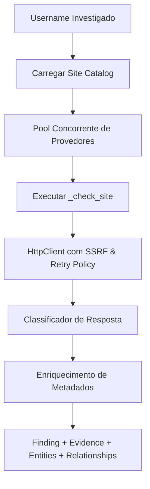

# Engine de Usernames

O motor de varredura de usernames (`spectre_osint/modules/username/`) executa a coleta paralela e a validação estruturada sobre o catálogo de plataformas.

---

## 1. Pipeline de Execução do Motor



---

## 2. O Predicado de Identidade JSON

No motor central (`engine.py`), a confirmação de provedores JSON obedece à função `_is_meaningful_json_identity`:

```python
def _is_meaningful_json_identity(value: Any) -> bool:
    if isinstance(value, bool):
        return False
    if isinstance(value, str):
        return bool(value.strip())
    if isinstance(value, int):
        return True
    return False
```

Isso garante a rejeição de valores nulos, strings vazias, apenas espaços em branco, booleanos e contêineres vazios, preservando inteiros válidos como identificadores numéricos.
